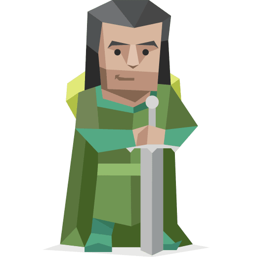

<!--
**Abayie/Abayie** is a ✨ _special_ ✨ repository because its `README.md` (this file) appears on your GitHub profile.

Here are some ideas to get you started:

- 🔭 I’m currently working on ...
- 🌱 I’m currently learning ...
- 👯 I’m looking to collaborate on ...
- 🤔 I’m looking for help with ...
- 💬 Ask me about ...
- 📫 How to reach me: ...
- 😄 Pronouns: ...
- ⚡ Fun fact: ...
-->

### Hello there 👋, I'm Jonathan Abayie Boahene

I feel called to serve a greater purpose in life. Thoughtful and idealistic, striving to have a positive impact on other people and the world around me. Believe I can do that through Technology.

  <a href="https://github.com/DenverCoder1/readme-typing-svg">

## ️ Languages and tools

##### Web Development
<code></code>
<code></code>
<code></code>
<code></code>
<code></code> 
<code></code>
<code></code>

     

 

  

